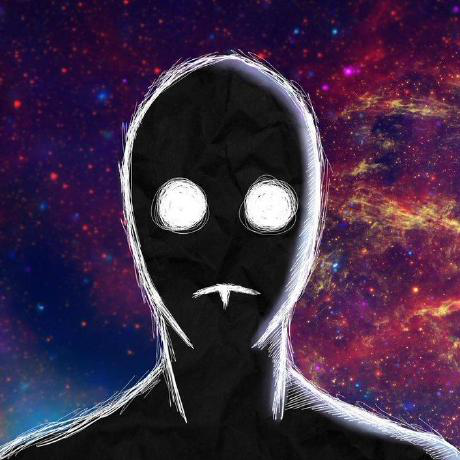

<h1 align="center">
  
</h1>

&nbsp;

  <i>
    <strong>"We have no talent and we must create."</strong> 
    A game collection made for you (and by AI, obviously).
  </i>

&nbsp;

  

&nbsp;

---

&nbsp;

<h3 align="center">◈ THE MANIFESTO ◈</h3>

  Why spend thousands of hours learning <b>Linear Algebra</b> or <b>Game Physics</b> when you can just ask a language model to "make it vibe"?  
  Welcome to the future of "development", where the only thing we actually <i>composed</i> was the prompt.  
  We don't fix bugs; we just ask the AI to "try again, but better this time".

&nbsp;

---

&nbsp;

<h3 align="center">◈ THE GAMES ◈</h3>

<table align="center">
  <tr>
    <td align="center" width="300">
        🎯  
      <a href="https://ciws.fowel.online"><b>Chill CIWS</b></a>  
      Watch CIWS firing for forever.
        
    </td>
    <td align="center" width="300">
        🛤️  
      <a href="https://fowel.online/games/pathfinder"><b>Pathfinder</b></a>  
      Maze solver simulation.
        
    </td>
  </tr>
  <tr>
    <td align="center">
        🚀  
      <a href="https://fowel.online/games/tank"><b>Tank</b></a>  
      Tank Trouble Remastered.
        
    </td>
    <td align="center">
        🎲  
      <a href="https://fowel.online/games/dice"><b>Dice Roller</b></a>  
      Roll the dice and see your fate.
        
    </td>
  </tr>
  <tr>
    <td align="center">
        🛡️  
      <a href="https://fowel.online/games/defender"><b>Defender</b></a>  
      Defend your base from incoming storm.
        
    </td>
    <td align="center">
        🌍  
      <a href="https://fowel.online/games/ascension"><b>Ascension: Earth 3618</b></a>  
      An escape from the ruined Earth.
        
    </td>
  </tr>
</table>

&nbsp;

---

&nbsp;

<h3 align="center">◈ OUR TALENT ◈</h3>

  Meet the prompt engineers who mastered the art of <i>Vibe Coding</i>.

<table align="center">
  <tr align="center">
    <td>
       
      <a href="https://github.com/ForeverWeLearn">@ForeverWeLearn</a> 
      "I prompt, therefore I am."
    </td>
    <td>
       
      <a href="https://github.com/sainoman15">@sainoman15</a> 
      "Hallucinating since 2024."
    </td>
    <td>
       
      <a href="https://github.com/KhuongDinh11">@KhuongDinh11</a> 
      "StackOverflow was too hard."
    </td>
    <td>
       
      <a href="https://github.com/hoangminhnhat2311-debug">@hoangminhnhat2311</a> 
      "Debug? Just re-generate."
    </td>
  </tr>
</table>

&nbsp;

---

&nbsp;

  <i>Build with 💖 (mostly by Gemini) by <b>TheHand-FPT</b></i>

